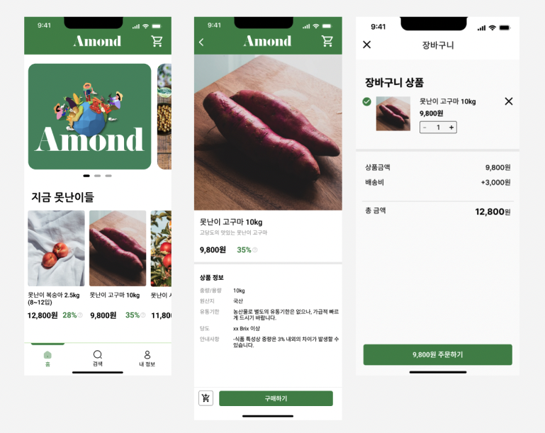
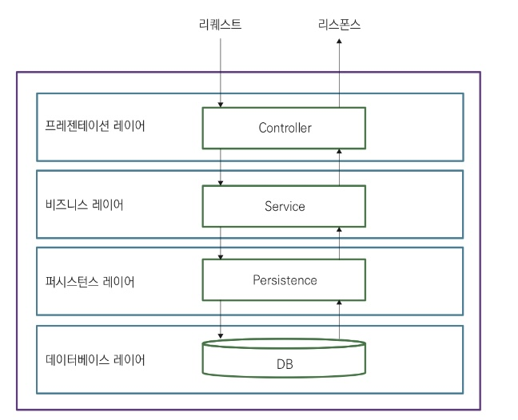
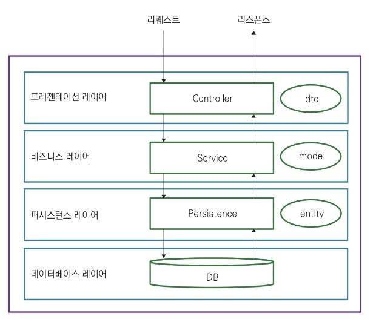
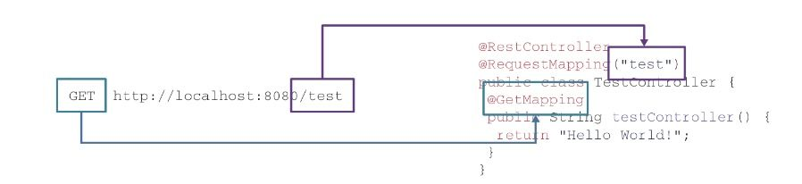
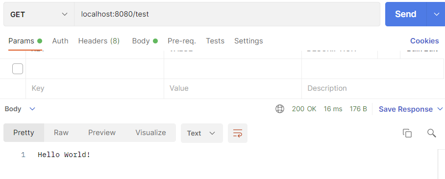
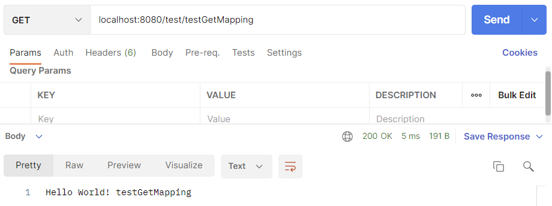
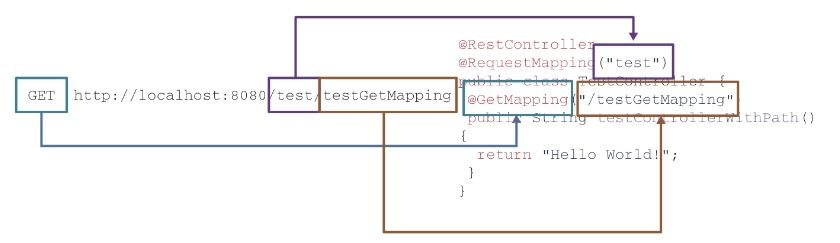
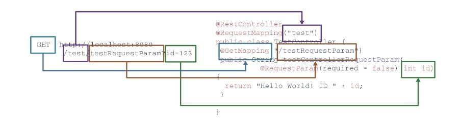
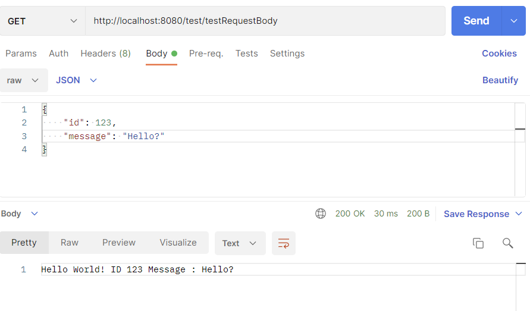
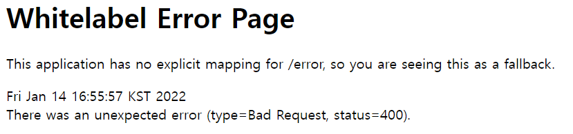

# REST API Controller

1. MVP 요구사항 분석
2. API 명세
3. 코드 리뷰 & 개념 설명

## MVP 요구사항 분석

---

1. 앱 실행 시 배너 사진이 나타난다
2. 메인 화면에서 상품 목록이 나타난다
3. 상품 목록에서 하나를 선택하면 해당 상품의 상세 정보가 나타난다
4. 상품을 장바구니에 담고 주문할 수 있다
5. 주문 내역을 조회할 수 있다
6. 주문 내역을 취소할 수 있다
    1. 주문 시 줄어들었던 상품 재고가 다시 늘어난다
7. 주문 시에 사용자는 배송지를 설정할 수 있다



## 명세

---

- [x]  배너 이미지 주소 조회하기 `user`
- [x]  상품 목록 조회 `user`
- [x]  상품 상세 조회 `user`
- [ ]  장바구니 상품 담기
- [ ]  장바구니 상품 제거하기
- [ ]  주문하기 `user`
- [ ]  주문내역 조회 `user`
- [ ]  배송지 등록하기 `user`
- [ ]  주문 취소하기 `user`

### 배너 이미지 주소 조회하기

```java
Req:
(GET) {host}/api/banners/

Res:
{
	[
		{
			url : "s3.ap-northeast-2.amazonaws.com/www.amondfarm.com/logo.png",
			id : 1
		},
		{
			url : "s3.ap-northeast-2.amazonaws.com/www.amondfarm.com/sample.png",
			id : 2
		}
	]
}
```

### 상품 목록 조회하기

```java
Req:
(GET) {host}/api/products/

Res:
{
	[
		{
			id: 1,
			name: "못난이복숭아",
			thumbnail: "https://s3.path.example/peach_pic",
			price: 3000,
			dcRate : 30
		},
		{
			id: 2,
			name: "못난이고구마",
			thumbnail: "https://s3.path.example/sweet_potato_pic",
			price: 1500
			dcRate : 25
		},
		...
	]
}
```

### 상품 상세 조회하기

```java
Req:
(GET) {host}/api/products/{id}

Res:
{
	id: {id},
	name: "못난이복숭아",
  description: "신선한 못난이 고구마에요~!",
	thumbnail: "https://s3.path.example/sweet_potato_pic",
	price: 3000,
	quantity: 72,
	discountRate : 30
  detailImage: "https://s3.path.example/peach_pic"
}
```

## 코드 리뷰 & 개념 설명

---

> 실제 코드 참조
> 
1. Layered Architecture 패턴
2. Model, Entity, DTO
3. 스프링 REST API 컨트롤러

### Layered Architecture 패턴

---



Layered Architecture 패턴은 **어플리케이션 구성요소들을 수평으로 나눠 관리**

> 수평으로 나눴다 → 메소드를 클래스 또는 인터페이스로 쪼개는 것
> 

레이어 사이에 계층이 존재, 레이어는 자기보다 **한 단계 하위의 레이어만 사용**하는 게 원칙 !

퍼시스턴스는 요청한 데이터를 반환하고, 서비스는 데이터를 검토 및 가공한 후 컨트롤러에게 반환,

컨트롤러 또한 데이터를 검토 및 가공한 후 응답을 반환한다.

> 물론 정해진 대로 하위 레이어만 사용해야 하는 것은 아니다.
> 
> 
> 필요에 따라 서비스가 서비스를 사용하기도 하고 레이어가 많은 경우 중간 레이어를 섞어 사용하기도 한다.
> 

하지만 기본적인 레이어드 아키텍처에서는 ***상위 레이어가 자신의 바로 하위 레이어를 사용*** 한다

### Model, Entity, DTO

---



클래스는 두 가지 종류로 나눌 수 있다.

1. 기능을 수행하는 클래스
2. 데이터를 담는 클래스

1번은 **컨트롤러**, **서비스**, **퍼시스턴스**처럼 로직을 수행한다.

데이터를 담는 클래스는 말 그대로 데이터만 가지고 있다.

위 예제 코드에서 만든 BannerService 는 List<Banner> 를 리턴한다.

Banner 오브젝트는 기능이 없다.

그냥 DB 에서 반환된 정보를 가지고 있을 뿐이다.

이렇게 아무 기능 없이 DB 에서 반환된 비즈니스 데이터를 담기 위한 클래스들이 있다.

그런 클래스들을 기능에 따라 Entity, Model, DTO (*Data Transfer Object*) 등으로 부른다.

### DTO

---

서비스가 요청을 처리하고 클라이언트로 반환할 때 모델 자체를 그대로 리턴하는 경우는 별로 없음

보통은 데이터를 전달하는 데 사용하는 오브젝트인 *Data Transfer Object* DTO 로 변환해 리턴

> 왜 그냥 모델을 리턴하지 않고 DTO 로 변환하는 것일까?
> 
1. **비즈니스 로직을 캡슐화하기 위해**
    
    모델은 DB 테이블 구조와 매우 유사하다.
    
    모델이 가지고 있는 필드들은 테이블의 스키마와 비슷할 확률이 높다.
    
    대부분의 비즈니스는 외부인이 자사의 DB 스키마를 아는 것을 원치 않는다.
    
    이 때 DTO 처럼 다른 오브젝트로 바꿔 변환하면 외부 사용자에게
    
    서비스 내부의 로직, DB 구조 등을 숨길 수 있다.
    
2. **클라이언트가 필요한 정보를 모델이 전부 포함하지 않는 경우가 많기 때문**
    
    가장 대표적인 예로 에러 메시지가 있다.
    
    만약 서비스 실행 도중 사용자 에러가 나면 이 에러 메시지를 어디에 포함해야 할까?
    
    모델은 서비스 로직과는 관련이 없기 때문에 모델에 담기에는 애매하다.
    
    이런 경우 DTO 에 에러 메시지 필드를 선언하고 DTO 에 포함하면 된다.
    

### 스프링 REST API 컨트롤러

---

> @RestController 어노테이션을 이용해 이 컨트롤러가 RestController 임을 명시 ‼️
> 
> 
> RestController 를 이용하면 http 와 관련된 코드 및 요청/응답 매핑을 스프링이 알아서 해줌
> 

HTTP 는 GET/POST/PUT/DELETE/OPTIONS 등과 같은 메소드와 URI 를 이용해

서버에 HTTP 요청을 보낼 수 있다.

다음과 같은 HTTP Request 가 있다고 가정하자.

```sql
GET /test HTTP/1.1
Host: localhost:8080
Content-Type: application/json
Content-Length: 17
{
	"id": 123
}
```

위 Request 는 [localhost:8080](http://localhost:8080) 에 http GET 메소드를 이용해 test 라는 리소스를 요청한다는 뜻이다.

따라서 서버는 자기 주소를 제외한 /{리소스} 부분을 이해하고

또 이 요청이 어떤 HTTP 메소드를 이용했는지 알아야 한다.

그 후 해당 리소스의 HTTP 메소드에 연결된 메소드를 실행해야 한다.

스프링 부트 스타터 웹 *spring-boot-starter-web* 의 어노테이션을 이용하면

이 연결을 쉽게 할 수 있다.

아래의 어노테이션은 전부 스프링 부트 스타터 웹 패키지에서 제공하는 것이다.

**TestController**

```java
package com.example.todoapp.controller;

import org.springframework.web.bind.annotation.RequestMapping;
import org.springframework.web.bind.annotation.RestController;

@RestController
@RequestMapping("test") // 리소스
public class TestController {
    
}
```

@RestController 어노테이션을 이용해 이 컨트롤러가 RestController 임을 명시한다.

RestController 를 이용하면 http 와 관련된 코드 및 요청/응답 매핑을 스프링이 알아서 해준다.

작성할 컨트롤러 테스팅을 위해 메소드를 다음과 같이 추가했다.

```java
@RestController
@RequestMapping("test") // 리소스
public class TestController {
    @GetMapping
    public String testController() {
        return "Hello World!";
    }
}
```

@GetMapping 어노테이션을 이용해 이 메소드의 리소스와 HTTP 메소드를 지정한다.

클라이언트가 이 리소스에 대해 Get 메소드로 요청하면

@GetMapping 에 연결된 컨트롤러가 실행된다.

예제 메소드에서는 “localhost:8080/test” 의 GET 메소드가 testController() 에 연결된다는 뜻이다.



API 테스트를 위해서 포스트맨을 이용

다음과 같이 Hello World 가 출력되는 것을 확인할 수 있다.



@RequestMapping(”test”) 는 URI 경로에, @GetMapping 은 HTTP 메소드에 매핑된다.

URI 경로를 @GetMapping 에서도 지정할 수 있다.

```java
@GetMapping("/testGetMapping")
public String testControllerPath() {
	return "Hello World! testGetMapping";
}
```

포스트맨에서 경로에 [localhost:8080/test/testGetMapping](http://localhost:8080/test/testGetMapping) 으로 GET 요청을 보내면

다음과 같이 응답이 반환되는 것을 확인할 수 있다.



@GetMapping 의 매개변수로 경로를 지정하는 경우

스프링이 어떻게 URI 를 매핑하는지 아래 그림으로 확인해보자.



스프링은 이 요청이 GET 요청임을 알기 때문에

GetMapping 이 지정된 메소드를 실행해야 한다는 사실을 안다.

또 testControllerWithPath() 의 클래스에 추가된 @RequestMapping(”test”) 와

@GetMapping(”/testGetMapping”) 을 통해

/test/testGetMapping 이 이 메소드에 연결되어야 한다는 사실도 안다.

@RequestMapping 어노테이션을 사용하지 않고 @GetMapping 만을 이용해서 사용할 수도 있다.

비슷한 어노테이션으로 `@PostMapping, @PutMapping, @DeleteMapping` 이 있는데

각각 HTTP 메소드가 POST, PUT, DELETE 를 의미한다.

> `@PostMapping, @PutMapping, @DeleteMapping`
> 
> 
> 이 어노테이션들은 Spring4.3 부터 지원되기 시작했다
> 

### 매개변수 넘겨받기

@PathVariable 을 이용하면 /{id} 와 같이 URI 의 경로로 넘어오는 값을 변수로 받을 수 있다.

```java
@GetMapping("/{id}")
public String testControllerPathVariables(@PathVariable(required = false) int id) {
	return "Hello World! ID " + id;
}
```

PathVariable 도 마찬가지로 아래 그림과 같이 매핑된다.

@GetMapping(”/{id}”) 의 매개변수 /{id} 는 경로로 들어오는 임의의 숫자 또는 문자를

변수 id 에 매핑하라는 뜻이다.

(required = false) 는 이 매개변수가 꼭 필요한 것은 아니라는 뜻이다.

따라서 id = 123 을 명시하지 않아도 에러가 나지 않는다.


또 다른 방법으로는 @RequestParam 을 이용하는 방법이 있다.

@RequestParam 을 이용하면 ?id={id} 와 같이 요청 매개변수로 넘어오는 값을 변수로 받을 수 있다.

```java
@GetMapping("/testRequestParam")
  public String testControllerRequestParam(@RequestParam(required = false) int id) {
      return "Hello World! ID " + id;
  }
```



@RequestBody 를 사용하는 방법도 있다.

@RequestBody 는 보통 반환하고자 하는 리소스가 복잡할 때 사용한다.

예를 들어 String 이나 int 같은 기본 자료형이 아니라

오브젝트처럼 복잡한 자료형을 통째로 요청에 보내고 싶은 경우가 이에 해당 !

```java
package com.example.todoapp.dto;

import lombok.Data;

@Data
public class TestRequestBodyDTO {
    private int id;
    private String message;
}
```

위와 같은 DTO 클래스를 하나 만들고

TestRequestBodyDTO 를 요청 body 로 받는 Controller 메소드를 추가해보자.

```java
@GetMapping("/testRequestBody")
public String testControllerRequestBody(@RequestBody TestRequestBodyDTO testRequestBodyDTO) {
	return "Hello World! ID " + testRequestBodyDTO.getId() + " Message : " + testRequestBodyDTO.getMessage();
}
```

다음과 같이 요청 바디를 넣고 실행하면 결과가 리턴되는 것을 확인할 수 있다.



이제까지는 문자열을 리턴했다.

만약 문자열보다 복잡한, 예를 들어 오브젝트를 리턴하려면 어떻게 해야 할까?

이를 구현하는 방법은 아주 간단하다.

@RestController 어노테이션 안에 그 간단함의 비밀이 있다.

@RestController 의 내부를 보면 크게 두 어노테이션의 조합으로 이루어져 있다.

```java
@Controller
@ResponseBody
public @interface RestController {
	...
}
```

하나는 @Controller 이고, 다른 하나는 @ResponseBody 이다.

@Controller 는 @Component 로 스프링이 이 클래스의 오브젝트를 알아서 생성하고

다른 오브젝트들과의 의존성을 연결한다는 뜻이다.

@ResponseBody 는 이 클래스의 메소드가 리턴하는 것은

웹 서비스의 ResponseBody 라는 뜻이다.

다시 말해 메소드가 리턴할 때 스프링은 리턴된 오브젝트를 JSON 형태로 바꾸고

HttpResponse 에 담아 반환한다는 뜻이다.

> 스프링이 오브젝트를 JSON 으로 바꾸는 것처럼,
> 
> 
> 오브젝트를 저장하거나 네트워크를 통해 전달할 수 있도록 변환하는 것을
> 
> ***직렬화 (serialization)***
> 
> 그 반대의 작업을
> 
> ***역직렬화(deserialization)*** 라고 한다
> 

```java
@GetMapping("/testResponseBody")
public ResponseDTO<String> testControllerResponseBody() {
  List<String> list = new ArrayList<>();
  list.add("Hello World! I'm ResponseDTO");
  ResponseDTO<String> response = ResponseDTO.<String>builder().data(list).build();
  return response;
}
```

마지막으로 ResponseEntity 에 대해 알아보자.

ResponseEntity 는 HTTP 응답의 바디뿐만 아니라 여러 다른 매개변수들,

예를 들어 status 나 header 를 조작하고 싶을 때 사용한다.

```java
@GetMapping("/testResponseEntity")
public ResponseEntity<?> testControllerResponseEntity() {
  List<String> list = new ArrayList<>();
  list.add("Hello World! I'm ResponseEntity. And you get 400!");
  ResponseDTO<String> response = ResponseDTO.<String>builder().data(list).build();
  // http status 를 400 으로 설정
  return ResponseEntity.badRequest().body(response);
}
```

URI 에 접속해보면 다음과 같이 400 Bad Request 가 반환되는 것을 확인할 수 있다.



## 정리

---

- Layered Architecture 패턴
    - Controller, Service, Persistence, Model/Entity 및 DTO 로 구성
- REST API
    - @RequestMapping
    - @GetMapping
    - @RequestBody
    - @RequestParam
    - @PathVariable
    - @ResponseBody